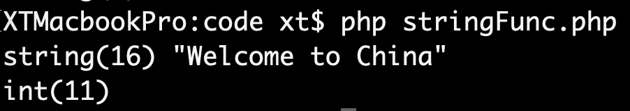
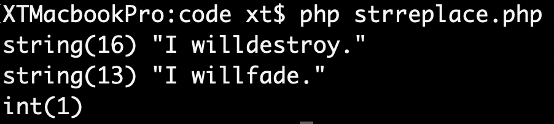
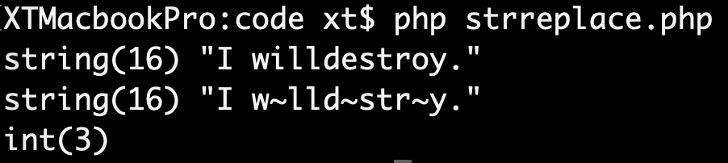
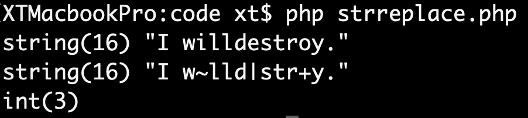
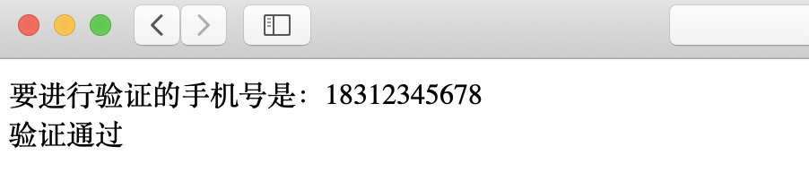
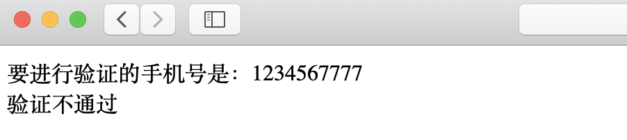

# Chapter11 字符串

## 字符串简介
在<a href="6 变量和数据类型.md">变量和数据类型</a>一章中，我们已经对字符和字符串进行了简略的介绍。我们提到，字符串是用单引号`''`或双引号`""`包含的一串字符，并且双引号中间可以插入变量，但单引号不可以。使用英文的符号`.`来连接两个字符串。

## 字符串操作函数
|函数名|功能|
|:--:|:--:|
|strlen|返回字符串长度|
|strtolower|将所有字符转为小写|
|strtoupper|将所有字符转为大写|

### html相关操作
|函数名|功能|
|:--:|:--:|
|htmlspecialchars|将html预定义的字符转换为HTML实体|
|strip_tags|去掉字符串中的html标签|

### 查找、截取、替换

#### `substr(str,start,length)`
`substr`函数将字符串`str`从`start`位置开始截取，共截取`length`长度，返回截取后的字符串。`length`参数可选，如缺少`length`参数，则截取到字符串末端。

```php
//stringFunc.php
$str = 'Welcome to China';
$subStr1 = substr($str,7,2);
$subStr2 = substr($str,7);

var_dump($str,$subStr1,$subStr2);
```


#### `strpos(str,find,start)`
`strpos`函数会在字符串`str`中搜索`find`，并返回第一次出现的位置。`start`参数可选，可指定从何处开始搜索。默认从`str`的开头开始搜索。

```php
//stringFunc.php
$str = 'Welcome to China';
$strPos = strpos($str,'China');

var_dump($str,$strPos);
```



#### `str_replace(find,replace,str,count)`
`str_replace`函数会在`str`字符串中搜索`find`子串，并将所有子串替换成`replace`字符串，并返回替换后的字符串。替换的数量将记录在`count`中。`count`参数可选。

```php
//strreplace.php
$str = 'I will destroy.';
$count = 0;
$newStr = str_replace('destroy','fade',$str,$count);
var_dump($str,$newStr,$count);
```


这个函数还有更多的用法。例如如果想将字符串中的元音字母都替换成其他符号，第一个参数`find`此时允许是数组。当`find`是数组，则会再`str`中搜索所有数组中出现的元素，替换成`replace`。

```php
//strreplace.php
$str = 'I will destroy.';
$count = 0;
$newStr = str_replace('destroy','fade',$str,$count);
var_dump($str,$newStr,$count);
```


如果`find`和`replace`都是数组的时候，则会按照两边数组的元素一一对应来替换。此时`replace`数组元素数量应该小于等于`find`数组元素的数量（理想情况应该是等于）。

```php
//strreplace.php
$str = 'I will destroy.';
$count = 0;
$newStr = str_replace(array('i','e','o'),array('~','|','+'),$str,$count);
var_dump($str,$newStr,$count);
```



如果两个数组数量不匹配，则会出现一些异常情况。如果`replace`数组元素少，`find`数组中没有对应到的元素则会替换成空字符。

## 字符串 & 数组
在<a href="10 数组.md">数组</a>一章中我们提到了`explode`和`implode`函数，在这里不重复叙述。

## 模式
**模式**这个词经常与另一个概念**正则表达式**同时出现。一个模式串可以表示一系列具有同样特征的字符串，模式串可以理解为是一系列字符串的概括。

>正则表达式不是单纯属于PHP的技术，正则表达式是一种独立的理念，它不属于任何技术，但是可以被其他很多技术使用。就像你在编程中会用到数学，但数学不属于任何编程语言，它是自然存在并且独立的。

`/[0-9]/`可以表示“任意一个数字”，`/[A-Za-z]/`则表示“任意一个字母”。正则表达式的一般格式是

```php
/表达式/[修正符]
```

正则表达式由若干个原子组成，每个原子允许是以下内容：
+ 单个字符、数字，如`a-z`，`A-Z`，`0-9`。 
+ 模式单元，如`(ABC)`可以理解为由多个原子组成的大的原子。 
+ 原子表，如`[ABC]`为A或B或C的其中之一。 
+ 重新使用的模式单元，如：`\\1`。
+ 普通转义字符，如：`\d`、`\D`、`\w`。
+ 转义元字符，如`\*`、`\.`。
+ 具有特殊意义的字符（被称为`元字符`）。

### 元字符
`[aoeiu]`表示任意一个单独的元音字母。`[0-9]`表示任意一位数字。`[a-z][0-9]`表示一个小写字母和一个数字组成的两位字符。`[a-zA-Z0-9]`表示任意一个大小写字母或数字。

`[^]`表示除了该元字符表示的字符之外的任何字符，相当于对`[]`取反。例如`[^0-9]`表示任意一位非数字字符。

`{m}`表示对前面元字符的数量控制。例如`[0-9]{4}`表示任意四位数字。`[1][35789][0-9]{9}`表示手机号码。

`{m,n}`也可以表示对前面元字符的数量控制，并提供了一个数量区间。例如`[a-z]{4,8}`表示4到8位的小写字母。

对元字符的数量控制上，还有几种简写方式。`*`表示任意次，等价于`{0,}`；`+`表示至少一次，等价于`{1,}`；`?`表示0次或1次，等价于`{0,1}`。例如正整数可以表示为`[1-9][0-9]*`，整数可以表示为`[\-]?[0-9]+`。

`()`表示一个整体的原子，例如`(ABC)`表示`ABC`这个字符串的整体，`(red|blue)`表示`red`或者`blue`，`(abc){2}`表示两个`abc`。

`^`用在正则表达式的开头，表示必须以此字符开头。`$`用在正则表达式的结尾，表示必须以此字符结尾。`.`表示除换行符之外的任意字符。

### 转义字符

|转义字符|含义|
|:--:|:--:|
|\d|匹配一个数字，等价于`[0-9]`|
|\D|匹配除数字以外任何一个字符，等价于`[^0-9]`|
|\w|匹配一个英文字母、数字或下划线，等价于`[0-9a-zA-Z_]`|
|\W|匹配除英文字母、数字和下划线以外任何一个字符，等价于`[^0-9a-zA-Z_]`|
|\s|匹配一个空白字符，等价于`[\f\n\r\t\v]`|
|\S|匹配除空白字符以外任何一个字符，等价于`[^\f\n\r\t\v]`|
|\f|匹配一个换页符，等价于`\x0c`或`\cL`|
|\n|匹配一个换行符，等价于`\x0a`或`\cJ`|
|\r|匹配一个回车符，等价于`\x0d`或`\cM`|
|\t|匹配一个制表符，等价于`\x09\`或`\cl`|
|\v|匹配一个垂直制表符，等价于`\x0b`或`\ck`|
|\oNN|匹配一个八进制数字|
|\xNN|匹配一个十六进制数字|
|\cC|匹配一个控制字符|

### 模式修饰符
模式修饰符放在正则表达式右边斜线的外侧，来修饰本次匹配。

`i`表示不区分大小写，即`/[a-zA-Z]/`等价于`/[a-z]/i`。

`s`表示匹配视为单行。

`U`会让匹配成功即停止，拒绝贪婪匹配。

### 正则表达式相关函数
#### `preg_match_all(pattern,subject,matches)`
#### `preg_match(pattern,subject,matches)`

`preg_match_all`会进行全文匹配，返回匹配的个数。`preg_match`只会匹配一次，成功返回1，否则返回0。

两个函数都会在`subject`中根据`pattern`模式进行匹配，将匹配到的结果放在`matches`中。其中`matches`参数可选，如果没有`matches`参数则只返回匹配个数，用于检查模式串是否匹配。

正则表达式的应用场景远比上面的描述要广泛得多，甚至可以将正则表达式当成一门独立的语言来进行学习。这里只进行简单的叙述。

下面我们编写一个简单的程序来体现正则表达式的作用。

> 用户会通过表单向服务器提交一个`phone`字符串，使用正则表达式检查这个字符串是否满足手机号的格式要求。

```php
//preg.php
$phone = $_GET['phone'];
$pregStr = "/1[3-8][0-9]{9}/i";
echo '要进行验证的手机号是：'.$phone.'<br/>';
if(preg_match($pregStr,$phone)){
	echo '验证通过';
}else{
	echo '验证不通过';
}
```

当我们向`$phone`变量传入一个标准手机号格式的字符串时，程序作出相应：



如果传入一个不合理的字符串：



**参数验证**是服务端的一项重要任务。在进行数据存取的相关开发时，有一条永恒的准则，那就是**永远不要相信用户提交的数据**。基于这条准则，参数验证就显得尤为重要。在上述问题中，如果用户没有提交手机号，而是提交了一个可以被执行的数据库操作语句，那么就有可能会对数据库造成意料之外的操作，甚至是破坏。一般这种攻击被称为**SQL注入**。

正则表达式经常用于**参数验证**或**内容搜索**，在web编程领域具有不可替代的地位。