# Chapter12 类与对象

这部分是面向对象编程的一些基础知识。实际上，学习面向对象编程理念并不会对你已有的编程技术产生一些短期内的提升，有时反而会扰乱了你的思维。如果你想先编写出可以拿得出手的程序，建议先跳过本章。

## 类 Class
**类**是在之前的叙述中都没有提到过的一种变量类型，可以理解为**类**是一种声明或定义。

在面向对象编程（如果你从没听过这个词，先向下看）中，一类具有相同特征的实体被抽象为类。举个例子，天下所有的人都是实际存在的，他们都具有生命，具有人类的特征，可以做其他人类该做的事情（普遍意义上来讲）。这样，他们就可以被抽象为一个类，类名叫做“人”。

一个类包含**属性**与**方法**。属性可以用来描述类的一些特征，方法则是该类可以进行的相关操作。

例如一个“人”类可以声明为：

(伪代码)
```
class 人{
	身高;
	体重;
	长相;
	肤色;
	国籍;
	//and so on...

	吃饭(){

	}

	睡觉(){

	}

	复读(){

	}
}
```

在PHP中，声明一个类的标准形式是：
```php
class className{
	$param1;
	$param2 = 'param2DefaultValue';

	function func(){
		//do something
	}
}
```
## 对象 Object
将一个类进行**实例化**，就定义了一个具有该类特征的实体，这个实体被称为**对象**。

在PHP中，实例化一个类的标准形式是：

```php
$obj = new className();
```

一个类可以被实例化成多个实体，多个实体彼此互相独立，在没有人为干扰的情况下互不影响。

在需要使用对象下的属性或者方法时，需要用到成员运算符`->`。例如如果需要使用`obj`对象下的`param1`属性，则使用`$obj->param1`来表示。如果要调用`obj`对象下的`func`方法，则用`$obj->func()`来表示。

下面的例程展示了类和对象的基本运作原理。

```php
class human{
	public $name;
	public $skinColor;
	public $language;

	public function introduce(){
		echo 'My name is '.$this->name.',my skin color is '.$this->skinColor.',my language is '.$this->language."\n\n";
	}
}

$xiaoming = new human();
$xiaoming->name = 'xiaoming';
$xiaoming->skinColor = 'yellow';
$xiaoming->language = 'Chinese';

$bob = new human();
$bob->name = 'bob';
$bob->skinColor = 'black';
$bob->language = 'English';

$xiaoming->introduce();
$bob->introduce();
```

这段代码中，我们先定义了一个“人”类。每个“人”都有姓名、肤色、语言三种属性，并且可以进行自我介绍。

当“人”进行自我介绍的时候，他会告诉你他的名字、肤色、语言。

接下来我们创建了两个“人”，分别是xiaoming和bob，并且为他们赋予了不同的特征。

然后让两位分别做自我介绍，可以看到两者的特征各不相同。

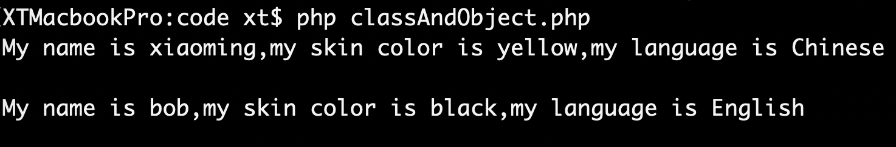

>## `this`
>
>`this`关键字用在类的描述中，表示`当前对象`，以便此类在日后被实例化成对象之后不要让他忘记自己。
>
> 在上面的例子中，this的作用是不管`human`类被实例化成了xiaoming还是bob，在自我介绍的时候都要报上他自己的特征。
## 面向过程 or 面向对象
在本章之前的所有内容都属于面向过程编程。面向过程编程只需要将想要做的事情依次使用编程语言描述给计算机，计算机读取程序依次执行。面向过程编程的性能比面向对象高，但不易复用且不不宜维护。程序量大了之后的维护工作简直是灾难。

面向对象是另一种思考问题的方式。其实如果不谈论程序，世间万物都可以用“类-对象”的思想来概括。面向对象编程易于维护，它将复杂的系统分为不同的模块，并且让不同模块间尽可能小地互相干扰，这样可以使系统更加灵活。相比于这么多优点，面向对象编程的缺点则是性能低，在性能方面的开销较大。

面向对象和面向过程两种方式各有优缺点，开发者需要在面对问题时合理选择需要使用的思维方式，来取得性能和功能两方向上的平衡。

## 面向对象编程的特性
面向对象编程有三大特性，即**封装**、**继承**、**多态**。

这三大特性将在后面的内容中逐渐介绍给你。

在面向对象编程中，类中的变量被称为“属性”，类中的函数被称为“方法”。

## 继承 extends
一个类可以继承自另外一个类，前者叫“子类”，后者叫“父类。子类默认具有父类所有的属性和方法。在类的内容丰富程度上来讲，父类应该是子类的子集。

在子类中如果需要描述父类的相关内容，则需要使用关键字
`parent`来表示父类。

继承使用关键字`extends`表示，在类的声明时需要注明继承自哪个类。继承关系在类的声明时这样表示：

```php
class childClass extends parentClass{

}
```

子类继承自父类的方法，可以在子类进行**重写**。即如果子类和父类有相同名称的方法，子类的方法会覆盖来自父类的方法。

可以编写一段程序来体现继承和重写。

首先我们定义一个“动物”类，这种动物具有名字、身高、体重，并且可以吼叫。它在吼叫的时候会告诉大家它是一个动物，还会喊出自己的名字。

对这个动物的描述是
```php
//extends.php
class animal{
	private $name;
	private $weight;
	private $height;

	public function __construct($name,$weight,$height){
		$this->name = $name;
		$this->weight = $weight;
		$this->height = $height;
	}

	public function speak(){
		echo "I'm a animal! I'm {$this->name}!\n";
	}
}
```

`__construct`是**构造函数**，会在类被实例化的时候调用。如果对这个还不太理解，可以试着先跳过。构造函数的相关内容马上就会讲到。

紧接着我们定义一个“人”类。“人”也是“动物”，也具有名字、身高、体重。这样子“人”就可以继承“动物”。

```php
//extends.php
class human extends animal{
	public function __construct($name,$weight,$height){
		$this->name = $name;
		$this->weight = $weight;
		$this->height = $height;
	}

	public function speak(){
		echo "I'm a human. I'm {$this->name}. \n"; 
	}
}
```

与动物不同的是，“人”的吼叫变为讲话。人在讲话的时候会告诉大家他是一个人类，并且还会讲出他的名字。此时“讲话”这个方法则需要重写。

接下来我们实例化两个类，查看结果。

```php
//extends.php
$doge = new animal('doge','10kg','20cm');
$xiaoming = new human('xiaoming','60kg','170cm');

$doge -> speak();
$xiaoming -> speak();
```

运行结果是

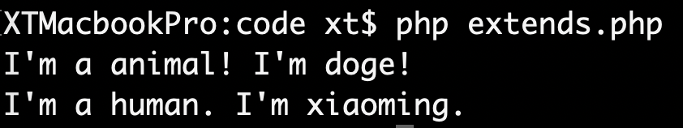

## 重载
在面向对象编程中，**重载**也是一个重要的特性。在同一个类中定义多个名字相同的方法，它们的返回值或者是参数个数不同，就可以实现不同的功能。这种特性是面向对象编程“多态”的一种体现。

但是**重载**特性在PHP中不支持，PHP不允许一个类中定义两个同名方法。

```php
//overloading.php
class animal{
	private $name;
	private $weight;
	private $height;

	public function __construct($name,$weight,$height){
		$this->name = $name;
		$this->weight = $weight;
		$this->height = $height;
	}

	public function speak(){
		echo "I'm a animal! I'm {$this->name}!\n";
	}

	public function speak($content,$loud){
		echo "I can speak what I want,".$content;
		for($i = 0;$i < $loud;$i ++){
			echo '!';
		}

		echo "\n\n";
	}
}

$specialAnimal = new animal('kriswu','70kg','180cm');
$specialAnimal -> speak();
$specialAnimal -> speak();
```

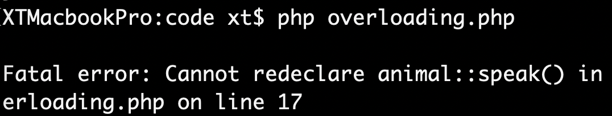

你只需要知道存在**重载**这种特性即可，PHP中往往使用**魔术方法**的方式来实现。具体的实现方法你可以查阅网上的资料。

## 访问控制：私有/公共/被保护
在定义类的属性时，可以对属性值进行更多的描述。

+ 当属性为私有`private`时，该属性只能在类中被访问；
+ 当属性为公共`public`时，该属性可以在类定义之外的其他时刻被访问；
+ 当属性为被保护`protected`时，该属性可以在该类及其子类中被访问。

为了验证这三种修饰词，我们要先准备两个具有继承关系的类。

```php
//prpupr.php
class Parents{
	private $pri = 'This is a private value';
	protected $pro = 'This is a protected value';
	public $pub = 'This is a public value';

	public function output(){
		var_dump($this->pri);
		var_dump($this->pro);
		var_dump($this->pub);
	}
}

class Child extends Parents{
	public function output(){
		var_dump($this->pri);
		var_dump($this->pro);
		var_dump($this->pub);
	}
}
```

然后我们要实例化一个类，查看结果。
```php
$parent = new Parents();
$parent->output();
var_dump($parent->pub);
var_dump($parent->pri);
var_dump($parent->pro);
```

运行结果是
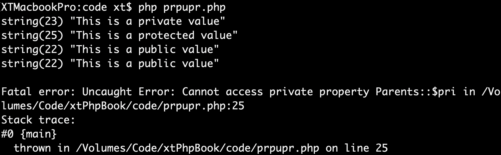

可以看到，如果在外部直接调用`output`，让`output`里面的`this`去访问类内部的属性，就都可以访问到。如果在类外边，通过对象名去访问类内部的私有方法，则会报错。

接下来实例化一个子类。

```php
$child = new Child();
$child->output();
```

运行结果是
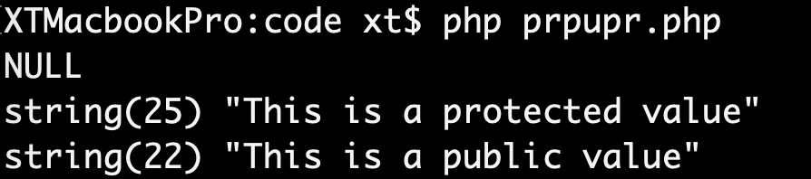

可以看到`protected`和`public`属性都可以在子类中访问到，但是`private`属性访问不到。

## 静态 `static`
可以使用`static`关键字来定义类中的属性或方法为**静态方法或属性**，这些方法和属性则会直接属于一个类，并且与对象无关。它们会在整个程序周期中一直存在，并且它们使用类名直接被调用。

由于静态方法可以不用实例化类而直接调用，所以静态方法中不能出现`$this`。

静态属性和静态方法的调用方式是

```php
Classname::$value;
Classname::func();
```

在类中要提到其他当前类中的静态属性或方法，则要使用`self`关键字。

```php
self::$value;
self::func();
```

下面一段程序则展示了静态属性属于一个类，与某个具体的对象无关。
```php
class Class1{
	static public $value = 1;

	public function add(){
		self::$value++;
	}
}

$c1 = new Class1();
$c2 = new Class1();

var_dump(Class1::$value);
$c1 -> add();
var_dump(Class1::$value);
$c2 -> add();
var_dump(Class1::$value);
```

运行结果是
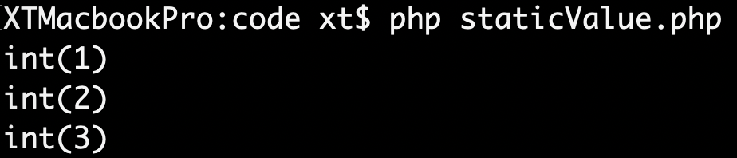

如果尝试使用对象的方法调用静态属性

```php
var_dump($c2->value);
```

则会输出null。

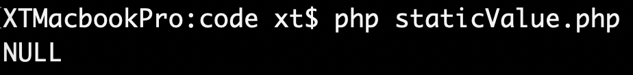

因为`$c2`这个对象中没有`$value`这个属性，这个属性属于`Class1`这个类，并不属于任何对象。

> ### 单例模式
> <blockquote>
PHP有一种经典的设计模式——**单例模式**，就很巧妙地应用了静态属性和静态方法。

```php
//singleInstance.php
class SingleInstance{
	private static $inst = false;

	private function __construct(){

	}

	public static function getInstance(){
		if(self::$inst){
			return self::$inst;
		}else{
			self::$inst = new self();
			return self::$inst;
		}
	}
}
```

单例模式的设计理念是，一个类只能被实例化成一个对象，再次实例化则只会得到已经存在的实例。

为了达到这个目的，则需要避免这个类的直接实例化，所以将构造方法设置为`private`，这样做可以避免类被`new`关键字直接实例化。

想要获取这个类的实例，只能通过预留的`getInstance`方法来实现。`getInstance`会将新创建的实例存到静态属性`$inst`中，检查到已存在实例，则取到之前创建的实例返回。

在整个过程中，`$inst`是静态属性，无论这个类被实例化了多少次，这个变量都不会因此而属于哪一个对象。

我们为这个类增加一个用来测试的属性和方法。

```php
//singleInstance.php
class SingleInstance{
	public $testValue = 1;

	public function inc(){
		echo "Call inc!\n";
		$this->testValue ++;
	}
}
```

由于`$testValue`是非静态的属性，那么如果实例化了类，它会属于自己的对象。接下来我们要创建两个实例，体验一下单例模式的魅力。

```php
//singleInstance.php
$obj1 = SingleInstance::getInstance();
$obj2 = SingleInstance::getInstance();
var_dump($obj1->testValue,$obj2->testValue);
$obj1->inc();
var_dump($obj1->testValue,$obj2->testValue);
$obj2->inc();
var_dump($obj1->testValue,$obj2->testValue);
```

运行程序
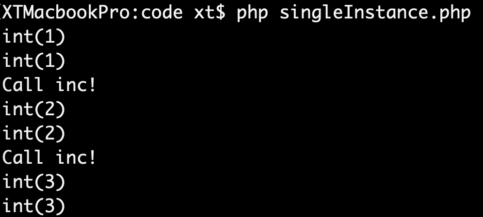

可以看到，当分别调用了`$obj1`和`$obj2`的`inc()`方法后，两个对象中的`$testValue`属性值相同。这就说明两次`inc()`操作的`$testValue`是同一个值。

实际上由于该类属于单例模式，`$obj1`和`$obj2`是同一个对象。

这样就可以测试二者是不是同一个对象了：
```php
if($obj1 === $obj2){
	echo "same!\n";
}
```

运行一下

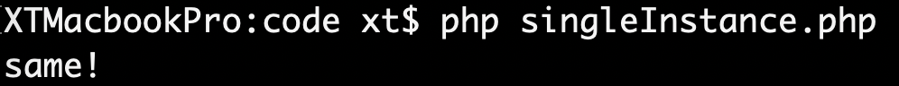

单例模式的优点是节约资源，在面向对象设计模式中是应用得特别多的一种设计模式。在设计数据库类的时候使用单例模式，可以避免同一个数据库在一个程序中被多次连接，这样可以节约很大的服务器资源开销。
</blockquote>

## 抽象 `abstract`
抽象可以用来描述类或方法。

抽象方法只允许描述定义和调用方式，在圆括号`()`之后直接以分号`;`结束，不允许有具体实现。抽象方法的具体实现交由它的子类来完成。

包含有抽象方法的类就要被定义为抽象类。包含抽象方法的抽象类这样表示：

```php
//abstract.php
abstract class AClass{
	abstract function aFunc();
}
```

被定义好的抽象方法，在子类中必须被实现。如果继承了父类后没有实现父类定义好的抽象方法，则会出现错误。

```php
//abstract.php
class Class1 extends AClass{
	
}
```

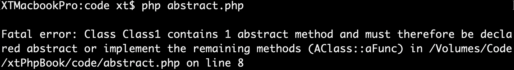

所以在子类中一定要实现父类定义的抽象方法。
```php
//abstract.php
class Class1 extends AClass{
	function aFunc(){
		echo "aFunc here!\n\n";
	}
}
```

实例化子类，调用已经实现的方法。
```php
//abstract.php
$obj1 = new Class1();
$obj1->aFunc();
```

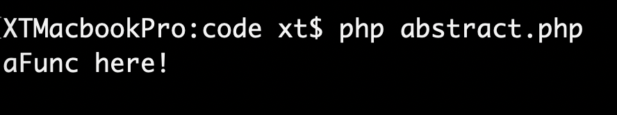

需要特别提到的是，抽象类不允许被实例化。

```php
//abstract.php
$obj2 = new AClass();
```

如果要实例化抽象类，则会报错。
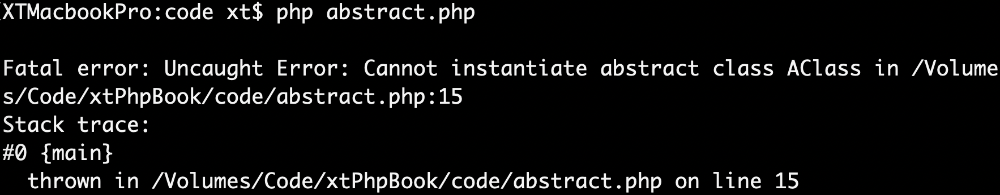

## 构造函数 `construct`
**构造函数**是在类中定义好的，创建对象时调用的方法。它只允许被叫作`__construct`，并且默认是`public`的。

在创建一个实例时，我们通常会使用

```php
new Classname();
```

来实例化一个对象。实际上是调用了`Classname`这个类中的构造函数。

如果一个类中的构造函数不是`private`的，那么它的子类会继承到父类的构造函数。但在子类的构造函数中不会自动调用父类的构造函数。如果需要，则需要在子类的构造函数中使用

```php
parent::__construct();
```

来显式调用父类的构造函数。

在讲解继承的时候，我们使用到了构造函数，并且提到
>`__construct`是**构造函数**，会在类被实例化的时候调用。如果对这个还不太理解，可以试着先跳过。构造函数的相关内容马上就会讲到。

构造函数经常用来做一些初始化的功能。例如在讲解继承的时候，我们使用构造函数对类的属性进行初始化。

```php
//extends.php
class animal{
	private $name;
	private $weight;
	private $height;

	public function __construct($name,$weight,$height){
		$this->name = $name;
		$this->weight = $weight;
		$this->height = $height;
	}

	public function speak(){
		echo "I'm a animal! I'm {$this->name}!\n";
	}
}
```
当创建这个类的实例的时候，类名括号里的参数就会被传入构造函数的参数列表中。

```php
new animal('name','weight','height');
```

实际上相当于（但不能这样写）
```php
animal::__construct('name','weight','height');
```

### 旧式的构造函数
在PHP5之前，构造函数被规定为，在类中与类名相同的方法。即
```php
class animal{
	public function animal($name,$weight,$height){
		$this->name = $name;
		$this->weight = $weight;
		$this->height = $height;
	}
}
```

PHP5为了做到向下兼容，在一个类实例化的时候如果找不到名字为`__construct`的方法，那么PHP会尝试寻找一个与类名同名的方法来作为构造函数。

这样的话，如果类中有一个名为`__construct`的方法却被用于其他用途，则会出现兼容性问题。

自PHP5.3.3起，在命名空间中，与类名同名的方法不再作为构造函数。但是一些其他的面向对象编程语言还坚持着这种传统。

## 析构函数 `destruct`
在PHP5中引入了析构函数。与构造函数相对地，析构函数会在某个对象被彻底销毁（所有引用都被销毁、显式销毁）之前调用。

如果有继承关系，父类的析构函数不会因为子类创建的对象被销毁而隐式调用。如果需要调用父类的析构函数，则需要使用

```php
parent::__destruct();
```

在子类的析构函数中来显式调用。

有趣的是，析构函数甚至会在调用`exit()`尝试终止脚本时调用。如果在析构函数中调用`exit()`，则会终止其余的关闭行为。

如果尝试在析构函数中抛出异常，则会出现致命错误。**异常**相关的内容将在后面进行讲解。

## 多文件
通常在习惯上，大家都是每个文件存放一个单独的类，一个单独的文件只负责一个单独的类的声明，执行则放在另外的文件中。如果想要让多个文件的类之间可以产生互动，或者是在一个文件中用到其他文件中声明的类，只需要使用文件包含函数将众多文件联结起来就可以了。

## 命名空间 `namespace`
脱离具体的编程语言，命名空间是一种封装事物的方法。在日常生活中也有很多应用体现了命名空间的思想。例如计算机文件系统中的文件夹概念。在同一个目录下不允许有重名文件，但在两个目录中就可以存在相同名字的文件。

在PHP中，命名空间的出现解决了在前后开发中出现重复类名因而发生冲突的问题。一个命名空间下的类不允许重名，但即使文件被连接了起来，只要两个类不在同一个命名空间中，就允许存在。

命名空间使用`namespace`来定义。通常一个文件只包含一个命名空间，但PHP允许单个文件出现多个命名空间，这种特殊的情况在本文档中不会提及。

定义一个命名空间的一般形式是

```php
namespace namespace1;
```

如果需要使用`namespace`语句，那么它只能出现在程序的第一行。

命名空间可以理解为是一种虚拟的路径，这个路径是你程序设计的结构。路径使用反斜线`\`来表示层次。例如也可以用

```php
namespace Home\Controller;
```

来定义一个更深的命名空间。

当需要引用一个命名空间，需要使用`use`关键字将其引入。

