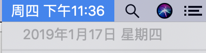

# Chatper14 日期与时间
在web编程中，日期与时间属于一种特殊的值，经常出现在各种不同的场景。在正式开始之前，你可能需要了解一下，在计算机的思想中，它是怎样去理解我们意识中的“时间”的。

## UNIX时间戳
在程序的世界中，造物主们将1970年1月1日（UTC/GMT的午夜）的第1秒规定为UNIX时间戳的第0秒。由于北京是+8时区，所以在中国，UNIX时间戳的起点是1970年1月1日早上的8时0分0秒。

如果在[一个可以查看时间戳的网站](http://tool.chinaz.com/Tools/unixtime.aspx)查询UNIX时间戳为0秒时候的时间日期，则可以看到


从这个起点开始，每过1秒，UNIX时间戳就增加1。UNIX时间戳统一了世界各地的计时单位，也让开发者在不同的开发平台上能去遵守同一个时间的表达规则。

UNIX时间戳的单位通常是**秒**，在PHP中默认也将获取到以秒为单位的UNIX时间戳。在其他的一些语言中会默认获取到毫秒。

对于时间，还有一个事情要做解释。

通常来说，PHP接收的时间戳范围应该是1901年12月13日（-2146648446）20:45:54到2038年1月19日03:14:07（2147454847），因为此范围符合32位有符号整数的最小值和最大值。

## 一些常见的数字
明白了UNIX时间戳的运行规则，我们接下来会列举一些在开发中常见的数字，这样可能会利于你更容易地了解UNIX时间戳。

|时间|秒|
|:--:|:--:|
|1分钟|60|
|1小时|3600|
|1天|86400|
|1周|604800|
|1月(30天)|2592000|
|1年 (365天)|31536000|

如果是毫秒的时间戳，则需要在上述数字基础上乘以1000。

## 在PHP中获取时间戳
在PHP中获取时间戳的内置函数是`time()`,它会返回当前的UNIX时间戳。

> 这个时间戳是以秒为单位的，如果下文中没有特别提及，则都默认为以秒为单位的时间戳。

例如调用这个函数

```php
//time.php
var_dump(time());
```

运行结果是


## 时间戳转换标准日期
时间戳虽然可以代表一个唯一并永不重复的时间点，但时间戳却有一个致命的弱点，那就是它不易阅读。除非借助程序或相关工具，否则时间戳是不能当成日期来显示给用户的。

在PHP中，系统提供了处理时间戳的函数。使用`date()`函数可以将时间戳转为表示日期的字符串。`date`的函数原型是：

```php
string date (string $format[,int $timestamp])
```

`$format`接收一个负责格式化的字符串，`date`会按照`$format`给定的格式来转换时间戳`$timestamp`。`$timestamp`是可选参数，默认值是`time()`。

我们尝试调用这个函数，来转换当前的时间戳。

```php
//now.php
$now = time();
$nowStr = date('Y-m-d H:i:s');
var_dump($now,$nowStr);
```

这段程序的运行结果是


但是这个日期和我的系统时间



并不相同。这其中的原因，我们稍后再讲解。现在当务之急是要讲解一下，格式化字符串`$format`都接收什么样的值。

上面的例子中，`Y`、`m`、`d`、`H`、`i`、`s`都是预定好的字符，它们在格式化字符串中有各自固定的意义。开发者可以按照自己的意愿任意排列这些预定好的字符，来实现自己想要的日期格式。

预定好的字符和它们各自的意义如下表所示。
### “日”相关
|字符|说明|举例|
|:--:|:--:|:--:|
|d|表示“日”的2位数字|01~31|
|j|表示“日”的数字，不会补0|1~31|
|S|表示每个月天数后面的2位英文字符，可以和`j`一起用|st、nd、rd、th|
|D|一周的第几天，3个字母|Mon~Sun|
|l|一周的第几天，完整的英文单词|Sunday到Saturday|
|N|用数字表示的周几<br/>这个是ISO-8601规定的|1（周一）~7（周日）|
|w|一周当中的第几天|0（周一）~6（周日）|
|z|一年当中的第几天|0~365|

### “星期”相关
|字符|说明|举例|
|:--:|:--:|:--:|
|W|一年当中的第几周，每周从周一开始<br/>这个是ISO-8601规定的<br/>需要PHP>4.0.1|42|

### “月”相关
|字符|说明|举例|
|:--:|:--:|:--:|
|F|完整的表示月份的单词|January~December|
|M|三个字母缩写表示的月份|Jan~Dec|
|m|2位数字表示的月份|01~12|
|n|数字表示的月份，不会补0|1~12|
|t|指定的月份有几天|28~31|

### “年”相关
|字符|说明|举例|
|:--:|:--:|:--:|
|L|是否是闰年|是为1，否为0|
|Y|4位数字表示的年份|2008|
|y|2位数字表示的年份|08|

### 时间相关
|字符|说明|举例|
|:--:|:--:|:--:|
|a|小写的上午或下午|am或pm|
|A|大写的`a`|AM或PM|
|g|12小时格式的时间数，不会补0|1~12|
|G|24小时格式的时间数，不会补0|0~23|
|h|12小时格式的2位时间数|01~12|
|H|24小时格式的2位时间数|00~23|
|i|2位分钟数|00~59|
|s|2位秒数|00~59|
|u|毫秒<br/>PHP>5.2.2|654321|

### 时区相关
|字符|说明|举例|
|:--:|:--:|:--:|
|e|时区标识<br/>PHP>5.1.0|UTC、GMT、Atlantic/Azores|
|I|是否为夏令时|是为1，否为0|
|T|本机所在时区|EST、MDT<br/>在windows下会变成完整的单词形式|
|c|ISO-8601格式的日期（PHP>5）|2004-02-12T15:19:21+00:00|
|r|RFC-822 格式的日期|Thu, 21 Dec 2000 16:01:07 +0200|

**所有在`$format`中不是规定字符组成的字符串，在`date()`的返回值中将按原样显示。**

如果要将字符串转换回时间戳，则需要使用`strtotime()`函数。也就是

```php
$time === strtotime(date('Y-m-d H:i:s',$time));
```

是成立的。

## 时区
接下来我们要解决上面提到的，格式化出当前时间与系统表示的时间并不相同。这是**时区**的问题。看过了格式化字符串之后，我们改造上面的代码：

```php
//now.php
$now = time();

#changed
$nowStr = date('T,Y-m-d H:i:s');

var_dump($now,$nowStr);
```

在新的版本中，我们在格式化字符串中使用`T`来查看当前时区，重新运行程序


我们发现当前系统的时区是`UTC`。UTC的意义是**协调世界时**，又称世界统一时间、世界标准时间、国际协调时间。而现在我所在的位置，是在中国所在的时区`Asia/Shanghai`。查阅资料可得知，`Asia/Shanghai`是**UTC+8**时区。所以，当前系统时间应该比程序所获取到的时间多8小时。这样解释就合理了。

那么如果我们的程序运行在中国，但展示给用户的却是UTC的时间，这样用户肯定不买账。所以我们需要在程序开始的时候指定时区。在PHP中使用`date_default_timezone_set()`函数指定时区。这个函数接收一个表示时区的字符串，例如上面提到的`Asia/Shanghai`。这个字符串接收的有效的值可以[查阅PHP手册](http://php.net/manual/zh/timezones.php)。