# Chapter10 数组
## 数组简介
在C语言中，我们对数组的定义是“将一些相同变量类型的值放在一个集合里”。而在PHP中，你可以将任何类型的变量或数值放在一个数组中。PHP中，数组可以理解为是**一组任何形式的值的集合**。

## 定义一个数组
与数组相关的关键字是`array`，你可以用这样的方式来创建一个数组：

```php
$arr = array();
```

在php5.4之后，数组的关键字新增了`[]`形式，也就是说，在php5.4之后，你可以用这样的方式来创建一个数组：

```php
$arr = [];
```

这种书写方式相比于之前便捷得多。

在之后的讲解中，都将使用`array`的形式。`array`形式的数组比较常见，而且不会有版本兼容问题。

PHP中的数组实际上是将任何形式的数据组织成了`键=>值`的形式，而且这种形式可以嵌套。例如下列代码分别展示了一位数组、二维数组以及多维数组的创建。

```php
$arr1 = array(1 => 'a',23 => 'bc',45 => 'de',678 => 'fgh');
```

```php
$arr2 = array(
	1 => 'a',
	2 => array(
		22 => 'bb',
		23 => 'bc'
	)
);
```

```php
$arr3 = array(
	'code' => 0,
	'msg' => '成功',
	'data' => array(
		0 => array(
			'name' => 'wyfan',
			'engname' => 'kris'
		),

		1 => array(
			'name' => 'hztao',
			'engname' => 'ztao'
		)
	)
);
```

## 使用数组
使用数组很简单，使用数组名+键名就可以访问了。普遍的形式是这样：

```php
//arr.php
echo $arr3['data'][0]['name'];
```

基于上面的`$arr3`的值，上面一行代码会输出


如果想要输出数组的值，可以直接使用`var_dump`函数。例如直接输出上面的`$arr3`的值：

```php
//arr.php
var_dump($arr3);
```

这样执行的结果是：
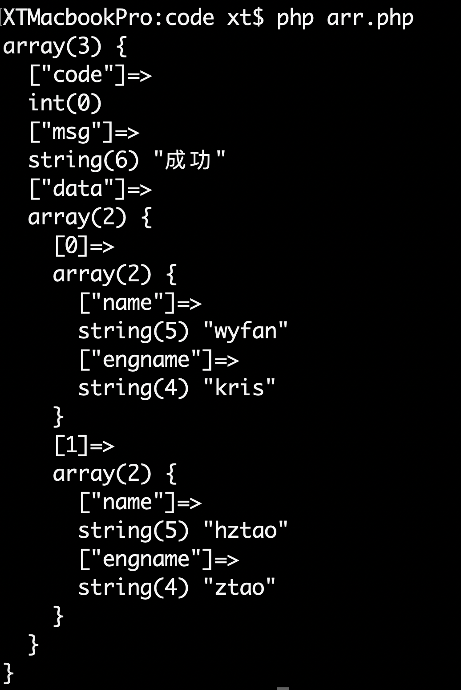

## 数组 & 字符串
在实际开发中经常会遇到类似这样的需求：

> 你可以从一些来源（文件或网页等）获取到类似这样的数据：
> 
> 小明,小红,小刚,小智,小霞,小茂,皮卡丘,大木博士
> 
> 将这样的数据整理成数组，再进行接下来的操作。

针对类似这样的问题，PHP提供了好用的函数`explode`来解决问题。`explode`函数的定义是

```php
explode(separator,string,limit);
```
|参数名|意义|
|:--:|:--:|
|separator|必需，分隔符|
|string|必需，要分割的字符串|
|limit|要返回的元素数目。<br/>大于 0 - 返回包含最多 limit 个元素的数组；<br/>小于 0 - 返回包含除了最后的 -limit 个元素以外的所有元素的数组；<br/>0 - 返回包含一个元素的数组|

例如上述问题可以用这种方式来解决：

```php
$str = '小明,小红,小刚,小智,小霞,小茂,皮卡丘,大木博士';
$arr = explode(',',$str);
var_dump($arr);
```

程序的运行结果是：

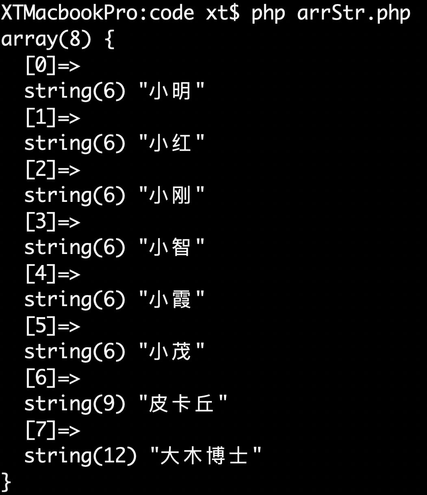

如果接下来需要存入数据库，那么数组就更容易接受了。

相对于`explode`，PHP还提供了对应的反函数`implode`，这个函数可以将数组变成字符串。`implode`函数的定义是

```php
implode(separator,array);
```

|参数名|意义|
|:--:|:--:|
|separator|可选。规定数组元素之间放置的内容。默认是 ""（空字符串）。|
|array|必需。要组合为字符串的数组。|

我们将上面的问题改一下。

>已有条件都不变，我们最终需要将列表变成竖线`|`分割的形式。

当然这个问题可以使用字符串替换`sre_replace`来解决，但是我们现在需要体现`implode`的作用，所以我们需要连续使用`explode`和`implode`两个函数。上面的问题可以这样解决：

```php
$str = '小明,小红,小刚,小智,小霞,小茂,皮卡丘,大木博士';
$arr = explode(',',$str);
$newStr = implode('|',$arr);
var_dump($newStr);
```

程序运行结果是

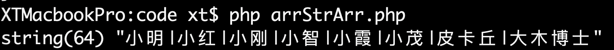

## 数组操作函数
### 堆栈 & 队列
堆栈和队列可以理解为是进出规则不同的两种容器。堆栈是后进先出（LIFO），用图表示则是这样的：

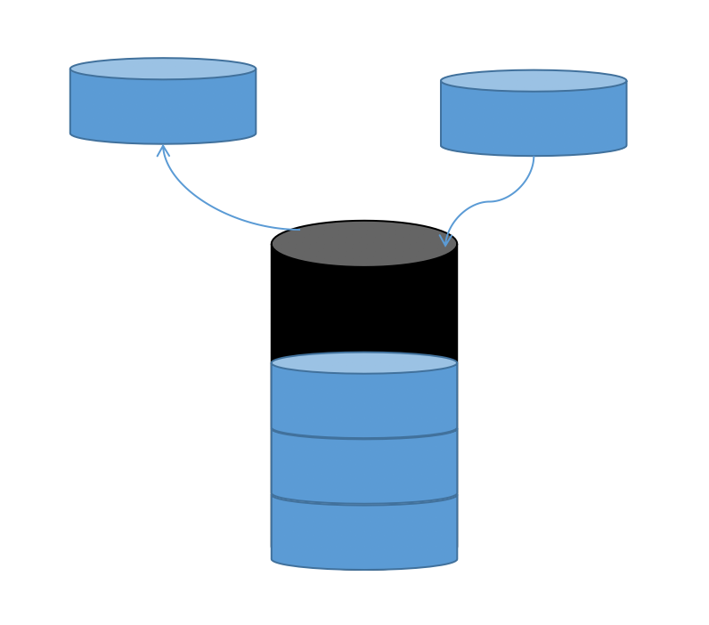

队列则是先进先出（FIFO）：
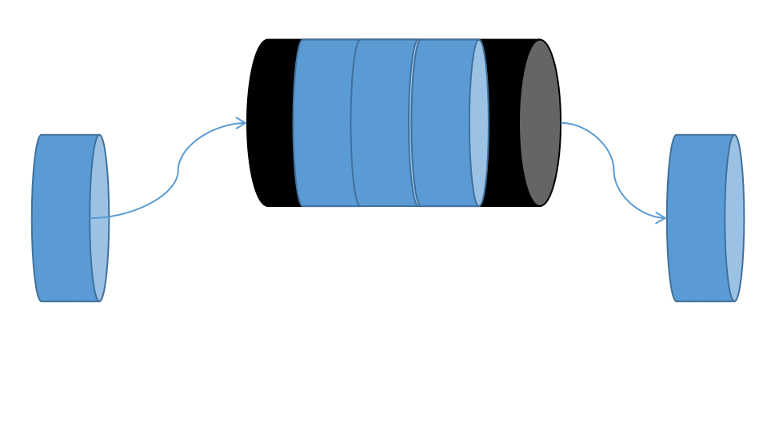

在PHP中，这两种结构都可以用数组来表示。对数组元素进行添加和删除，涉及到了如下函数。

#### `array_push(arr,value1,value2,...)`

将一个值追加在数组末端，返回新数组元素的个数。
|参数|解释|
|:--:|:--:|
|arr|必需，要进行操作的数组|
|value1|必需，要追加进数组的值|
|value n|其他要追加进数组的值|

此函数还有一种简略的形式

```php
$arr[] = $value;
```

这种方式也会将值添加在数组末端，也就是说`array_push`相当于多次调用上述形式。**如果只需要将一个值加入数组，不如用上述形式便捷，同时也没有调用了函数的负担。**

即使数组是键值对形式，新加入的元素的键依然是数字。

我们可以用这样一个程序来测试`array_push`。

```php
//arraypush.php
$arr = array(
	'first' => 'apple',
	'second' => 'banana'
);
$newValue = 'orange';

var_dump($arr);
$res = array_push($arr,$newValue);
var_dump($arr,$res);
$arr[] = 'cherry';
var_dump($arr);
```

运行程序，我们可以看到程序的运行结果。

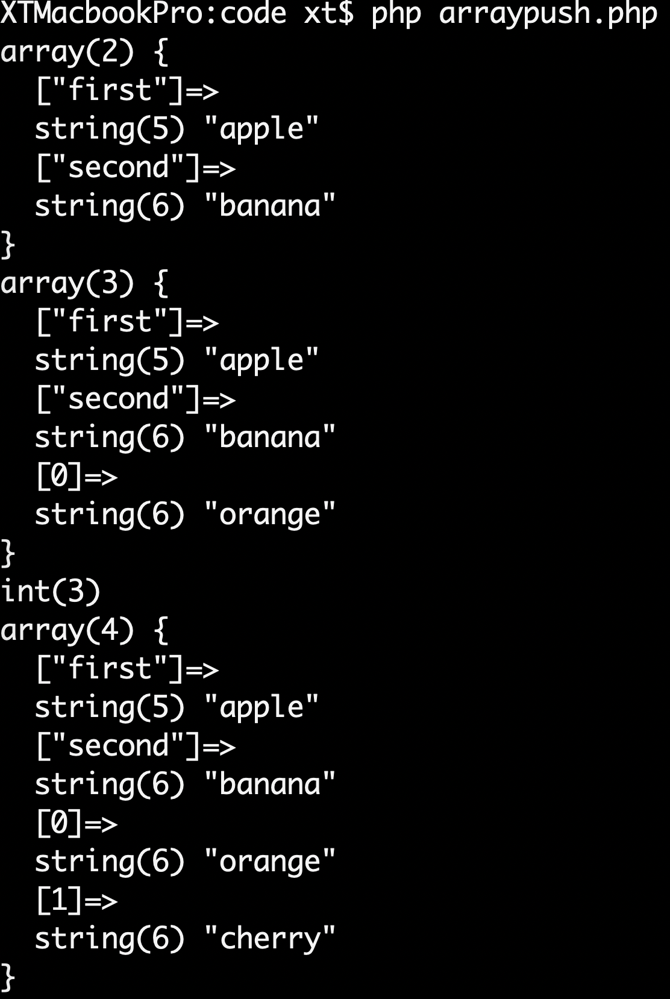

`array_push`返回了新数组的元素个数，新加入的元素的键是数字。并且两种添加元素的方法产生了相同的作用。

在实际应用中，数组最外层大多是数字键，这种数组往往表示一个列表。所以在`array_push`的应用场景下，你不必担心新元素的键是数字的问题。

#### `array_pop(arr)`
删除数组arr的最后一个元素，如果操作成功则返回最后一个元素值，如果arr非数组或数组是空的，则返回NULL。如果arr不是数组，系统还会给出警告。

|参数|解释|
|:--:|:--:|
|arr|必需，要操作的数组|

对此只需要一段简短的代码就可以测试这个函数的作用了。

```php
//array_pop.php
$arr = array(
	'first' => 'apple',
	'second' => 'banana'
);

$lastValue = array_pop($arr);

$fakeArr = 'fake';
$emptyArr = array();

$test1 = array_pop($fakeArr);
$test2 = array_pop($emptyArr);

var_dump($lastValue,$arr,$test1,$test2);
```

程序运行结果是
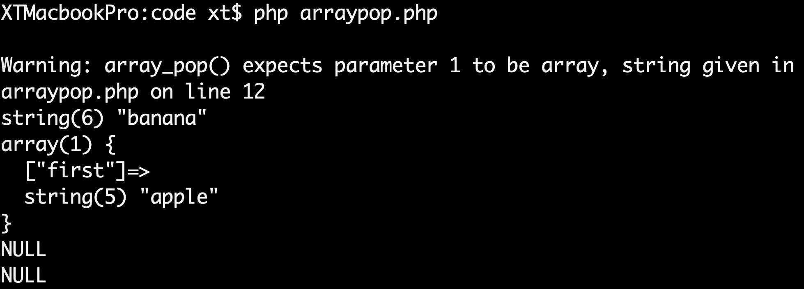

#### `array_shift(arr)`
删除并返回arr的第一个元素。如果数组本身是以数字为键，则新数组会获得新的键，从0开始并递增。

|参数|解释|
|:--:|:--:|
|arr|必需，要操作的数组|

为此我们要编写一段程序来测试结果。

```php
//array_shift.php
$arr = array('apple','banana','cherry');
var_dump($arr);

$firstValue = array_shift($arr);
var_dump($firstValue,$arr);
```

程序的运行结果是
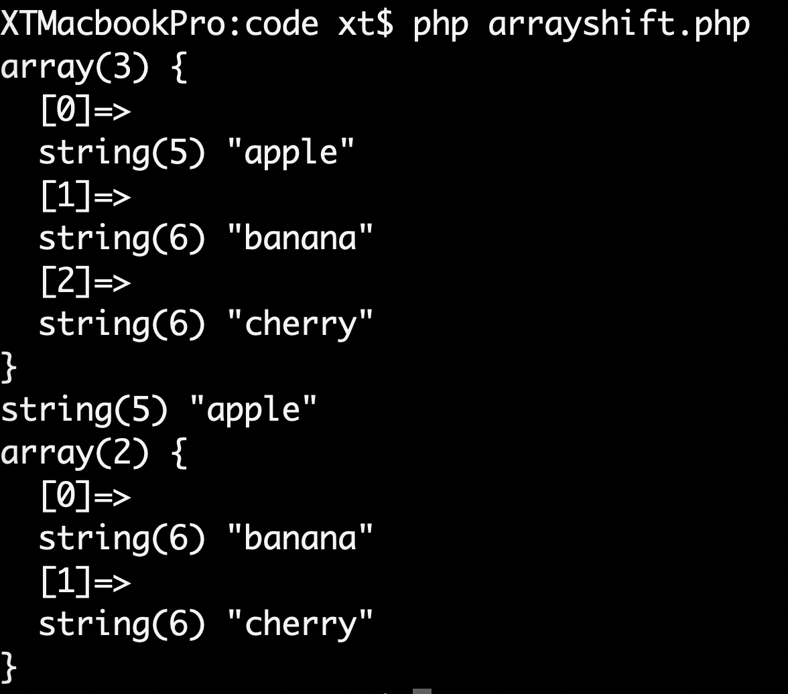

#### `array_unshift(arr,value1,value2,value3...)`
向数组arr头部插入元素，返回新数组的元素个数。数组键将从0开始递增，新元素的顺序与参数顺序保持一致。

|参数|解释|
|:--:|:--:|
|arr|必需，要进行操作的数组|
|value1|必需，要插入进数组的值|
|value n|其他要插入进数组的值|

接下来的例程将要测试此函数的功能。

```php
//arrayunshift.php
$arr = array('apple','banana','cherry');
var_dump($arr);

$res = array_unshift($arr,'pig','monkey');
var_dump($arr,$res);
```

程序的运行结果是
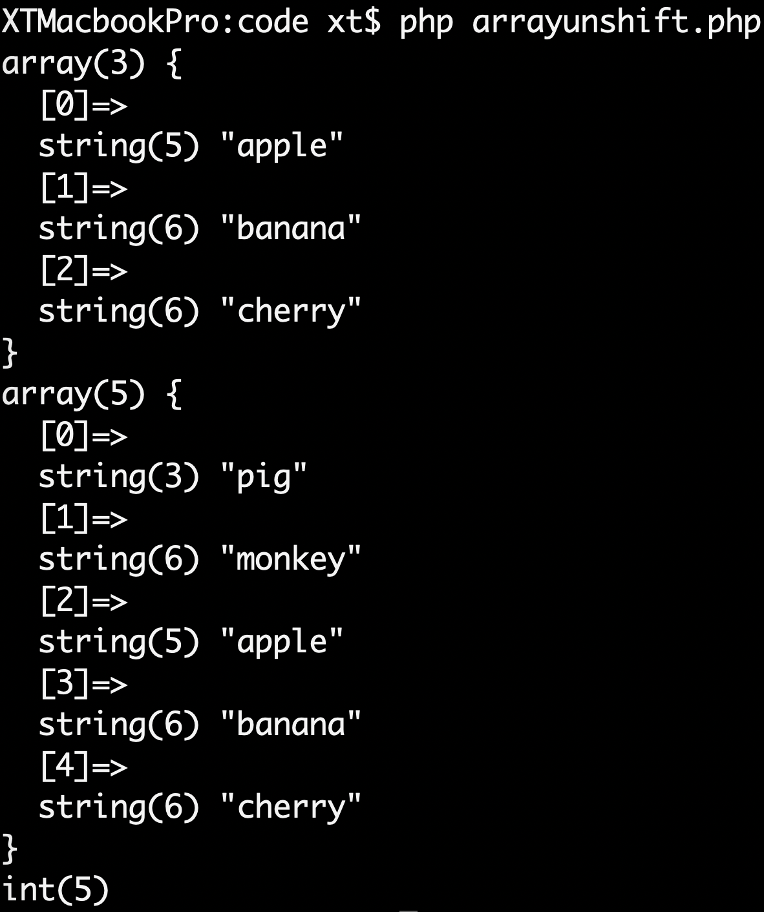

### 键 & 值
使用`array_values`函数可以得到数组值组成的新的数组，使用`array_keys`函数可以得到数组键组成的新的数组。

```php
//keysAndValues.php
$arr = array(
	'code' => 0,
	'msg' => 'success',
	'data' => array(
		array(
			'classname' => 'chinese',
			'classtime' => '8:00',
			'classroom' => '501'
		),

		'what are you nongshalei?'
	)
);

$keys = array_keys($arr);
$values = array_values($arr);

var_dump($keys,$values);
```

上述代码运行结果是

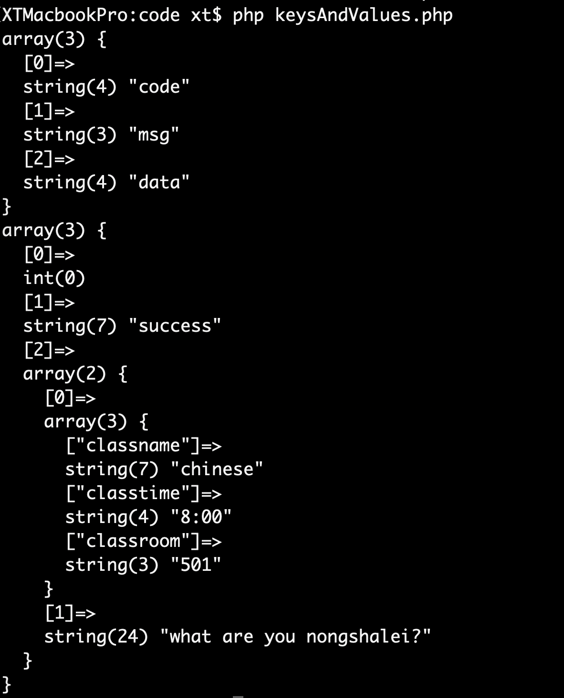

### 遍历
PHP中使用`foreach`结构可以遍历数组的所有元素，并对数组元素进行相应处理。`foreach`结构的一般形式是

```php
foreach($arr as $key => $value){
	//do something
}
```
在循环体中，`$key`表示当前循环的键，`$value`表示当前循环的值。`$key`和`$value`都是临时变量，每次循环都会使其变化，并在循环体执行完毕后不复存在。

当不需要关注数组键的时候，`foreach`还有简略形式：

```php
foreach($arr as $value){
	//do something
}
```

下面我们使用`foreach`结构，将一个“待办事项”数组向用户输出为一个代办清单。

```php
//foreach.php
$arr = array('week up','wash face','go out','work','back home','sleep');
echo "you will do following things tomorrow:\n";
foreach($arr as $k => $v){
	echo $k.':'.$v."\n";
}

echo "finish!\n";
```

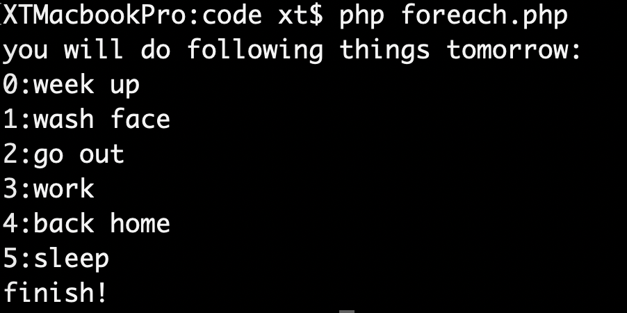

### 数组排序
|函数名|作用|
|:--:|:--:|
|sort|使数组按照升序排序|
|rsort|使数组按照降序排序|
|ksort|根据键的升序排序|
|asort|根据值的升序排序|
|krsort|根据键的降序排序|
|arsort|根据值的降序排序|

### 其他的数组相关常用函数
#### 量取长度 `count`
#### 去重 `array_unique`
#### 合并 `array_merge`
#### 拆分 `array_slice`
#### 随机取值 `array_rand`
#### 随机洗牌 `shuffle`

数组的相关操作函数还有很多，在此不一一列举。你可以根据实际开发需要查询相关函数。